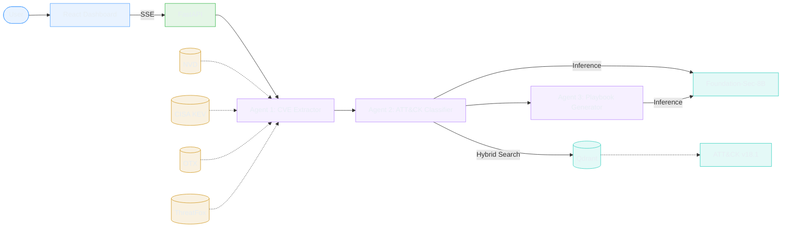

# Agentic Cybersecurity Threat Analyst

A multi-agent cybersecurity threat analysis system that ingests CVE/threat intelligence feeds, maps them to MITRE ATT&CK techniques via RAG (Retrieval-Augmented Generation), and generates incident response playbooks with Sigma detection rules.

Built with LangGraph for agent orchestration, Qdrant for vector search, and a local security-focused LLM.

## Architecture

> **Interactive version:** Open [`docs/architecture.html`](https://ayansk11.github.io/Agentic_Cybersec_Threat_Analyst/docs/architecture.html) for an animated, clickable diagram with detailed node descriptions and live data-flow particles.



### Agent Pipeline

| Agent | Role | Output |
|-------|------|--------|
| **CVE Extractor** | Parses CVE IDs, enriches via NVD/CISA KEV/OTX/ThreatFox, extracts structured threat info | Severity, attack vector, CWEs, IOCs |
| **ATT&CK Classifier** | RAG over 19K+ MITRE ATT&CK chunks, maps vulnerability to techniques with confidence scores | Technique IDs, tactics, rationale |
| **Playbook Generator** | Generates NIST SP 800-61 playbooks and Sigma YAML detection rules | Markdown playbook + Sigma rule |

## Features

- **Multi-Agent Pipeline** — Sequential LangGraph agents with SSE streaming for real-time progress
- **Hybrid RAG Search** — Dense (BGE-M3) + sparse vector search with Reciprocal Rank Fusion over MITRE ATT&CK
- **Multi-Source Enrichment** — NVD API, CISA KEV catalog, AlienVault OTX pulses, abuse.ch ThreatFox IOCs
- **Structured Output** — NIST SP 800-61 playbooks + copy-ready Sigma detection rules
- **Threat Feed Dashboard** — Browse recent CVEs, OTX pulses, and ThreatFox IOCs with severity filtering
- **Authentication & RBAC** — JWT + OAuth2 (Google/GitHub) with admin/analyst roles, rate limiting
- **Observability** — Prometheus metrics, structured logging with request ID tracking, webhook notifications
- **Local LLM** — Runs entirely on your machine using Ollama (no API keys required for core functionality)

## Prerequisites

- **Python** 3.11+
- **Node.js** 18+ with pnpm
- **Docker** (for Qdrant vector database)
- **Ollama** (for local LLM inference)
- ~8 GB disk space (for model + ATT&CK data)

## Quick Start

### 1. Clone and Install

```bash
git clone https://github.com/ayansk11/Agentic_Cybersec_Threat_Analyst.git
cd Agentic_Cybersec_Threat_Analyst

# Backend
pip install -e "backend/.[dev]"

# Frontend
cd frontend && pnpm install && cd ..
```

### 2. Start Qdrant

```bash
make qdrant
```

### 3. Pull the LLM Model

```bash
make pull-model
```

This downloads the Foundation-Sec-8B-Reasoning model (~5 GB). If your hardware can't run 8B models, edit `.env` to use a smaller model.

### 4. Ingest MITRE ATT&CK Data

```bash
make ingest
```

Downloads MITRE ATT&CK STIX v18.1 and ingests 19,233 chunks (techniques, mitigations, software, groups, relationships) into Qdrant with hybrid dense+sparse vectors.

### 5. Start the Application

Open **3 terminals** from the project root:

```bash
# Terminal 1: Backend
make dev

# Terminal 2: Frontend
make frontend

# Terminal 3: Qdrant is already running from step 2
```

### 6. Use the App

Open **http://localhost:5173** in your browser. Enter a CVE ID (e.g., `CVE-2021-44228`) and click **Analyze**. Watch the 3-agent pipeline process in real time.

## Configuration

Copy `.env.example` to `.env` and customize:

| Variable | Default | Description |
|----------|---------|-------------|
| `OLLAMA_HOST` | `http://localhost:11434` | Ollama server URL |
| `OLLAMA_MODEL` | `hf.co/fdtn-ai/Foundation-Sec-8B-Reasoning-Q4_K_M-GGUF` | Model name |
| `LLM_PROVIDER` | `ollama` | LLM provider (`ollama` or `groq`) |
| `QDRANT_HOST` | `localhost` | Qdrant host |
| `QDRANT_PORT` | `6333` | Qdrant port |
| `QDRANT_COLLECTION` | `mitre_attack` | Qdrant collection name |
| `NVD_API_KEY` | *(empty)* | Optional NVD API key for higher rate limits |
| `OTX_API_KEY` | *(empty)* | AlienVault OTX API key (free, enables OTX feed) |
| `GROQ_API_KEY` | *(empty)* | Groq API key (if using Groq provider) |
| `JWT_SECRET` | *(empty)* | Secret for JWT tokens (enables auth when set) |
| `JWT_ALGORITHM` | `HS256` | JWT signing algorithm |
| `GOOGLE_CLIENT_ID` | *(empty)* | Google OAuth2 client ID |
| `GOOGLE_CLIENT_SECRET` | *(empty)* | Google OAuth2 client secret |
| `GITHUB_CLIENT_ID` | *(empty)* | GitHub OAuth2 client ID |
| `GITHUB_CLIENT_SECRET` | *(empty)* | GitHub OAuth2 client secret |
| `WEBHOOK_URL` | *(empty)* | Webhook URL for analysis notifications |
| `WEBHOOK_SEVERITY_THRESHOLD` | `HIGH` | Minimum severity to trigger webhooks |
| `COOKIE_SECURE` | `false` | Set `true` in production behind HTTPS |

## Data Sources

All data sources are free and publicly available:

| Source | Description | Auth |
|--------|-------------|------|
| [NVD API 2.0](https://services.nvd.nist.gov) | CVE details, CVSS scores, CWEs | Optional API key |
| [CISA KEV](https://www.cisa.gov/known-exploited-vulnerabilities-catalog) | Known exploited vulnerabilities | None |
| [MITRE ATT&CK](https://attack.mitre.org/) | Adversary tactics & techniques (STIX v18.1) | None |
| [AlienVault OTX](https://otx.alienvault.com/) | Threat pulses & IOCs | Free API key |
| [abuse.ch ThreatFox](https://threatfox.abuse.ch/) | Malware IOCs | None |

## API Reference

| Method | Endpoint | Description |
|--------|----------|-------------|
| `GET` | `/` | API info |
| `GET` | `/api/health` | Service connectivity status |
| `GET` | `/api/stats` | Qdrant KB stats + service status |
| `GET` | `/api/cve/{cve_id}` | Fetch CVE details from NVD |
| `POST` | `/api/analyze` | Run full analysis (returns complete result) |
| `POST` | `/api/analyze/stream` | Run full analysis with SSE streaming |
| `GET` | `/api/feed/recent` | Recent CVEs from NVD |
| `GET` | `/api/feed/otx` | Recent OTX threat pulses |
| `GET` | `/api/feed/threatfox` | Recent ThreatFox IOCs |
| `GET` | `/api/analysis/history` | Analysis history (paginated) |
| `GET` | `/api/analysis/{id}` | Get analysis by ID |
| `POST` | `/api/auth/register` | Register new user |
| `POST` | `/api/auth/login` | Login with email/password |
| `POST` | `/api/auth/refresh` | Refresh access token |
| `POST` | `/api/auth/logout` | Logout and revoke tokens |
| `GET` | `/api/auth/me` | Current user profile |
| `GET` | `/api/auth/providers` | Available auth providers |
| `GET` | `/api/auth/oauth/{provider}/login` | OAuth2 login redirect |
| `GET` | `/api/auth/admin/users` | List users (admin only) |
| `PATCH` | `/api/auth/admin/users/{id}` | Update user role/status (admin) |

## Running Tests

```bash
# Run all 150 backend tests
make test
```

Tests cover:
- Agent pipeline (state, JSON parsing, all 3 agents with mocked LLM)
- End-to-end pipeline integration (full 3-agent flow with mocked externals)
- Data ingestion (NVD, CISA KEV, OTX, ThreatFox parsers)
- RAG pipeline (chunker for all entity types)
- API endpoints (all routes with mocked dependencies)
- Authentication (JWT, OAuth2, password hashing, token management)
- Database persistence (SQLite CRUD, history, aggregations)
- Caching layer (TTL cache hit/miss)
- Webhooks (threshold filtering, HTTP dispatch)
- Rate limiting, logging, metrics
- Schema validation (Pydantic models)

## Docker Deployment

Deploy the full stack with Docker Compose:

```bash
# Build and start all services (Qdrant + Backend + Frontend)
make docker-up

# Ingest ATT&CK data into the containerized Qdrant
make docker-ingest

# View logs
make docker-logs

# Stop everything
make docker-down
```

The frontend is served via nginx on port 80, proxying API requests to the backend. Ollama runs on the host machine — the backend container connects to it via `host.docker.internal`.

## Project Structure

```
Agentic_Cybersec_Threat_Analyst/
├── backend/
│   ├── main.py                    # FastAPI entry point
│   ├── config.py                  # Settings (Pydantic BaseSettings)
│   ├── db.py                      # SQLite persistence (analyses)
│   ├── db_users.py                # User/token/settings CRUD
│   ├── cache.py                   # In-memory TTL caching
│   ├── webhooks.py                # Severity-based webhook dispatch
│   ├── mailer.py                  # Async SMTP email (verification, reset)
│   ├── metrics.py                 # Prometheus counters + histograms
│   ├── logging_config.py          # Structured logging + request IDs
│   ├── agents/
│   │   ├── state.py               # LangGraph shared state (TypedDict)
│   │   ├── graph.py               # LangGraph StateGraph wiring
│   │   ├── cve_extractor.py       # Agent 1: CVE extraction + enrichment
│   │   ├── attack_classifier.py   # Agent 2: ATT&CK mapping via RAG
│   │   └── playbook_generator.py  # Agent 3: Playbook + Sigma generation
│   ├── rag/
│   │   ├── embedder.py            # BGE-M3 dense+sparse encoding
│   │   ├── retriever.py           # Hybrid search with RRF fusion
│   │   ├── qdrant_store.py        # Qdrant client + upsert
│   │   └── chunker.py             # Entity-level chunking
│   ├── ingestion/
│   │   ├── ingest_attack.py       # MITRE ATT&CK STIX ingestion
│   │   ├── mitre_loader.py        # STIX bundle parser
│   │   ├── nvd_fetcher.py         # NVD API 2.0 client
│   │   ├── cisa_kev.py            # CISA KEV catalog
│   │   ├── otx_fetcher.py         # AlienVault OTX client
│   │   └── abusech_fetcher.py     # abuse.ch ThreatFox client
│   ├── api/
│   │   ├── routes.py              # REST + SSE endpoints
│   │   ├── schemas.py             # Pydantic request/response models
│   │   ├── auth.py                # JWT + API key auth dependency
│   │   ├── auth_routes.py         # Auth endpoints (register, login, OAuth)
│   │   ├── oauth.py               # Google + GitHub OAuth2 providers
│   │   └── rate_limit.py          # Per-user/IP rate limiting
│   └── tests/                     # 150 tests
│       ├── conftest.py
│       ├── test_agents.py
│       ├── test_api.py
│       ├── test_auth.py
│       ├── test_cache.py
│       ├── test_db.py
│       ├── test_e2e.py
│       ├── test_ingestion.py
│       ├── test_logging.py
│       ├── test_metrics.py
│       ├── test_rag.py
│       ├── test_rate_limit.py
│       └── test_webhooks.py
├── frontend/
│   └── src/
│       ├── App.tsx                # Main app with routing
│       ├── components/
│       │   ├── Dashboard.tsx      # System status + KB stats + charts
│       │   ├── ThreatFeed.tsx     # NVD/OTX/ThreatFox feed tabs
│       │   ├── AnalysisView.tsx   # CVE analysis + results display
│       │   ├── LoginPage.tsx      # Auth UI (login/register/OAuth)
│       │   ├── AdminUsersPage.tsx # User management (admin)
│       │   ├── SettingsPage.tsx   # Webhook + SMTP configuration
│       │   ├── Layout.tsx         # App shell with sidebar
│       │   └── UserMenu.tsx       # User info + logout
│       ├── contexts/AuthContext.tsx # Auth state + token management
│       ├── api/client.ts          # API client with token refresh
│       ├── hooks/useSSE.ts        # SSE streaming hook
│       └── types/index.ts         # TypeScript interfaces
├── .github/workflows/ci.yml      # CI pipeline (lint, test, build)
├── docker-compose.yml             # Qdrant + Backend + Frontend + Prometheus
├── Dockerfile.backend
├── Dockerfile.frontend
├── nginx.conf                     # Nginx reverse proxy + SSE support
├── prometheus.yml                 # Prometheus scrape config + alerts
├── alert_rules.yml                # Prometheus alerting rules
├── Makefile                       # Dev + Docker commands
└── data/                          # Downloaded STIX bundles
```

## Security

- **JWT Authentication** — Access tokens (15 min) + refresh tokens (7 days) with rotation
- **OAuth2** — Google and GitHub SSO with CSRF state protection
- **RBAC** — Admin and analyst roles with per-endpoint access control
- **Rate Limiting** — Per-user/IP limits (5 analyses/min, 30 feed requests/min)
- **Password Security** — bcrypt hashing, email verification, secure password reset flow
- **API Key Fallback** — Legacy `X-API-Key` header support for backward compatibility

When no `JWT_SECRET` is configured, the API operates in open-access mode with a synthetic admin user for development convenience.

## Tech Stack

**Backend:** Python 3.13, FastAPI, LangGraph, LangChain, Qdrant, BGE-M3, Pydantic

**Frontend:** React 19, TypeScript, Vite, Tailwind CSS 4, Recharts, Lucide Icons

**Infrastructure:** Ollama (Foundation-Sec-8B-Reasoning), Qdrant (hybrid vector DB), Docker, nginx, Prometheus
